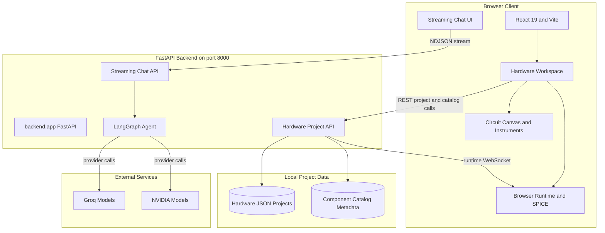
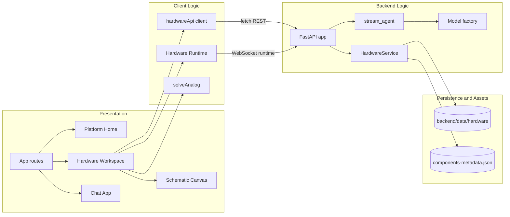

# Architecture Diagram

This diagram describes the active `simply` application at the workspace root. The `vendor/velxio` tree is treated as a referenced asset source, not as the primary runtime application.

## Application Architecture

<!-- mermaid-checked: no \n, no em-dash/en-dash, no {} in labels, subgraphs are id["label"], arrows are -->|"label"|, all subgraphs closed by end, ids unique -->

### Technology Stack Summary

| Layer | Technology | Version | Purpose |
|---|---|---:|---|
| Client | React and TypeScript | React 19 | Application UI and routing |
| Client | Vite | 8 | Development server and production bundling |
| Client | Zustand and browser state | 5 | Workspace and runtime state |
| Client | ngspice WASM | Local bundle | DC and transient analog solving |
| API | FastAPI and Uvicorn | FastAPI 0.142.2 | HTTP, streaming, and WebSocket endpoints |
| AI | LangChain and LangGraph | 1.4.3 / 1.2.12 | Model orchestration and hardware tools |
| Storage | JSON files | Local | Hardware project persistence |
| Tooling | Python subprocesses | Local | Arduino compilation and project operations |

### Data Storage & External Services

The backend persists hardware projects as JSON files under `backend/data/hardware` and reads component and board metadata from the catalog assets. There is no database in the active root application. Chat requests stream through the backend to either Groq or NVIDIA, depending on the selected provider and configured environment variables. Analog circuit solving runs in the browser through the local SPICE runtime.

### Key Architectural Decisions

- The browser owns the interactive circuit workspace and analog simulation loop.
- FastAPI is a local-only coordination layer for project persistence, catalog access, firmware operations, chat, and runtime WebSockets.
- The agent exposes validated hardware operations through LangGraph tools instead of allowing arbitrary shell execution.

## Component Relationships

<!-- mermaid-checked: no \n, no em-dash/en-dash, no {} in labels, subgraphs are id["label"], arrows are -->|"label"|, all subgraphs closed by end, ids unique -->

### Component Inventory

| Component | Layer | Type | Responsibility |
|---|---|---|---|
| `App` | Presentation | React router | Selects home, project, chat, and preview screens |
| `HardwareWorkspace` | Presentation | React workspace | Coordinates project editing, runtime state, and tools |
| `SchematicCanvas` | Presentation | React canvas | Renders and edits components, wires, and analog results |
| `ChatApp` | Presentation | React chat UI | Sends messages and renders streamed agent events |
| `hardwareApi` | Client Logic | Fetch client | Calls project, catalog, command, and runtime endpoints |
| `Hardware Runtime` | Client Logic | WebSocket client | Connects the browser simulation to a project session |
| `solveAnalog` | Client Logic | WASM integration | Runs DC or transient circuit analysis locally |
| `FastAPI app` | Backend Logic | API application | Hosts health, chat, hardware, and runtime routes |
| `HardwareService` | Backend Logic | Domain service | Validates and mutates project JSON, catalog, firmware, and artifacts |
| `stream_agent` | Backend Logic | LangGraph workflow | Executes validated hardware tools and streams results |
| `Model factory` | Backend Logic | Provider adapter | Builds Groq or NVIDIA chat model clients |
